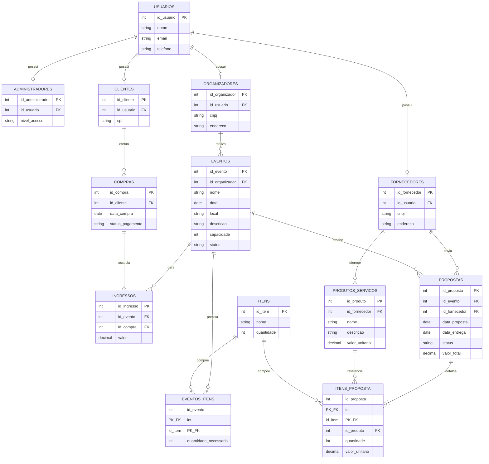

# Modelagem do Banco de Dados — InterLink

Este documento apresenta a modelagem do banco de dados do projeto **InterLink**, plataforma de organização e venda de ingressos para eventos, que conecta **Organizadores**, **Fornecedores** de produtos/serviços e **Clientes**.

O modelo foi derivado do **Diagrama Entidade-Relacionamento (DER) conceitual** elaborado previamente para o sistema (arquivo [`modelo-conceitual-BRMW.pdf`](./modelo-conceitual-BRMW.pdf), construído em [BRModeloWeb](https://app.brmodeloweb.com/conceptual/6ab1e51fd4acd21f13d77f4f)), transformado aqui no **modelo lógico/relacional**, já com tabelas, chaves primárias (PK), chaves estrangeiras (FK) e cardinalidades entre elas.

## 📊 Diagrama Relacional

> O diagrama acima é renderizado automaticamente pelo GitHub (sintaxe [Mermaid](https://mermaid.js.org/)). Caso não seja exibido, veja a descrição textual completa das tabelas logo abaixo.

## 🗂️ Dicionário de Dados

### `USUARIOS`
Tabela base que representa qualquer pessoa cadastrada no sistema. É especializada (herança **total e disjunta**) em `ADMINISTRADORES`, `ORGANIZADORES`, `CLIENTES` e `FORNECEDORES` — ou seja, todo usuário é obrigatoriamente um, e apenas um, desses quatro papéis.

| Coluna | Tipo | Chave | Descrição |
|---|---|---|---|
| id_usuario | INT | PK | Identificador único do usuário |
| nome | VARCHAR | | Nome completo |
| email | VARCHAR | | E-mail de acesso (único) |
| telefone | VARCHAR | | Telefone de contato |

### `ADMINISTRADORES`
| Coluna | Tipo | Chave | Descrição |
|---|---|---|---|
| id_administrador | INT | PK | Identificador único do administrador |
| id_usuario | INT | FK → `USUARIOS.id_usuario` | Usuário correspondente |
| nivel_acesso | VARCHAR | | Nível de permissão do administrador no sistema (ex: master, suporte) |

### `ORGANIZADORES`
| Coluna | Tipo | Chave | Descrição |
|---|---|---|---|
| id_organizador | INT | PK | Identificador único do organizador |
| id_usuario | INT | FK → `USUARIOS.id_usuario` | Usuário correspondente |
| cnpj | VARCHAR | | CNPJ do organizador |
| endereco | VARCHAR | | Endereço do organizador |

### `CLIENTES`
| Coluna | Tipo | Chave | Descrição |
|---|---|---|---|
| id_cliente | INT | PK | Identificador único do cliente |
| id_usuario | INT | FK → `USUARIOS.id_usuario` | Usuário correspondente |
| cpf | VARCHAR | | CPF do cliente |

### `FORNECEDORES`
| Coluna | Tipo | Chave | Descrição |
|---|---|---|---|
| id_fornecedor | INT | PK | Identificador único do fornecedor |
| id_usuario | INT | FK → `USUARIOS.id_usuario` | Usuário correspondente |
| cnpj | VARCHAR | | CNPJ do fornecedor |
| endereco | VARCHAR | | Endereço do fornecedor |

### `EVENTOS`
| Coluna | Tipo | Chave | Descrição |
|---|---|---|---|
| id_evento | INT | PK | Identificador único do evento |
| id_organizador | INT | FK → `ORGANIZADORES.id_organizador` | Organizador responsável pelo evento |
| nome | VARCHAR | | Nome do evento |
| data | DATE | | Data de realização |
| local | VARCHAR | | Local do evento |
| descricao | TEXT | | Descrição do evento |
| capacidade | INT | | Capacidade máxima de público |
| status | VARCHAR | | Situação do evento (ex: planejado, confirmado, encerrado) |

### `INGRESSOS`
| Coluna | Tipo | Chave | Descrição |
|---|---|---|---|
| id_ingresso | INT | PK | Identificador único do ingresso |
| id_evento | INT | FK → `EVENTOS.id_evento` | Evento ao qual o ingresso pertence |
| id_compra | INT | FK → `COMPRAS.id_compra` (aceita nulo) | Compra à qual o ingresso foi associado (nulo enquanto não vendido) |
| valor | DECIMAL(10,2) | | Valor do ingresso |

### `COMPRAS`
| Coluna | Tipo | Chave | Descrição |
|---|---|---|---|
| id_compra | INT | PK | Identificador único da compra |
| id_cliente | INT | FK → `CLIENTES.id_cliente` | Cliente que efetuou a compra |
| data_compra | DATETIME | | Data/hora da compra |
| status_pagamento | VARCHAR | | Situação do pagamento (ex: pendente, aprovado, cancelado) |

### `PROPOSTAS`
| Coluna | Tipo | Chave | Descrição |
|---|---|---|---|
| id_proposta | INT | PK | Identificador único da proposta |
| id_evento | INT | FK → `EVENTOS.id_evento` | Evento para o qual a proposta foi enviada |
| id_fornecedor | INT | FK → `FORNECEDORES.id_fornecedor` | Fornecedor que enviou a proposta |
| data_proposta | DATE | | Data de envio da proposta |
| data_entrega | DATE | | Data prevista de entrega |
| status | VARCHAR | | Situação da proposta (ex: enviada, aceita, recusada) |
| valor_total | DECIMAL(10,2) | | Valor total da proposta |

### `PRODUTOS_SERVICOS`
| Coluna | Tipo | Chave | Descrição |
|---|---|---|---|
| id_produto | INT | PK | Identificador único do produto/serviço |
| id_fornecedor | INT | FK → `FORNECEDORES.id_fornecedor` | Fornecedor que oferece o produto/serviço |
| nome | VARCHAR | | Nome do produto/serviço |
| descricao | TEXT | | Descrição |
| valor_unitario | DECIMAL(10,2) | | Valor unitário |

### `ITENS_PROPOSTA`
Tabela associativa que detalha os itens de cada proposta.

| Coluna | Tipo | Chave | Descrição |
|---|---|---|---|
| id_proposta | INT | PK, FK → `PROPOSTAS.id_proposta` | Proposta à qual o item pertence |
| id_item | INT | PK, FK → `ITENS.id_item` | Item genérico do catálogo referenciado |
| id_produto | INT | FK → `PRODUTOS_SERVICOS.id_produto` | Produto/serviço do fornecedor correspondente ao item |
| quantidade | INT | | Quantidade proposta |
| valor_unitario | DECIMAL(10,2) | | Valor unitário praticado na proposta |

### `ITENS`
Catálogo de itens/insumos genéricos (ex.: cadeiras, som, iluminação) usados tanto no planejamento dos eventos quanto nas propostas dos fornecedores.

| Coluna | Tipo | Chave | Descrição |
|---|---|---|---|
| id_item | INT | PK | Identificador único do item |
| nome | VARCHAR | | Nome do item |
| quantidade | INT | | Quantidade padrão/disponível |

### `EVENTOS_ITENS`
Tabela associativa que define quais itens um evento necessita.

| Coluna | Tipo | Chave | Descrição |
|---|---|---|---|
| id_evento | INT | PK, FK → `EVENTOS.id_evento` | Evento que necessita do item |
| id_item | INT | PK, FK → `ITENS.id_item` | Item necessário |
| quantidade_necessaria | INT | | Quantidade necessária do item para o evento |

## 🔗 Relacionamentos e Regras de Negócio

| Relacionamento | Cardinalidade | Regra de negócio |
|---|---|---|
| Usuários → Administradores/Organizadores/Clientes/Fornecedores | 1 : 1 | Todo usuário assume exatamente um papel no sistema (herança total e disjunta) |
| Organizadores → Eventos | 1 : N | Um organizador pode realizar vários eventos; cada evento pertence a um único organizador |
| Eventos → Ingressos | 1 : N | Um evento gera vários ingressos; cada ingresso pertence a um único evento |
| Clientes → Compras | 1 : N | Um cliente pode efetuar várias compras; cada compra é feita por um único cliente |
| Compras → Ingressos | 1 : N | Uma compra pode associar um ou mais ingressos; cada ingresso é associado a, no máximo, uma compra |
| Fornecedores → Propostas | 1 : N | Um fornecedor pode enviar várias propostas |
| Eventos → Propostas | 1 : N | Um evento pode receber várias propostas de fornecedores |
| Fornecedores → Produtos/Serviços | 1 : N | Um fornecedor pode oferecer vários produtos/serviços |
| Propostas → Itens_Proposta | 1 : N | Cada proposta é detalhada em um ou mais itens |
| Produtos/Serviços → Itens_Proposta | 1 : N | Um produto/serviço pode aparecer em várias linhas de proposta |
| Itens → Itens_Proposta | 1 : N | Um item do catálogo pode compor várias linhas de proposta |
| Eventos → Eventos_Itens | 1 : N | Um evento pode precisar de vários itens |
| Itens → Eventos_Itens | 1 : N | Um item pode ser necessário em vários eventos |

## 📎 Modelo Conceitual de Referência

O modelo conceitual original (notação Peter Chen, elaborado no BRModeloWeb) que deu origem a este modelo relacional está disponível em [`modelo-conceitual-BRMW.pdf`](./modelo-conceitual-BRMW.pdf).

---
[⬅️ Voltar ao README principal](../../../README.md)
